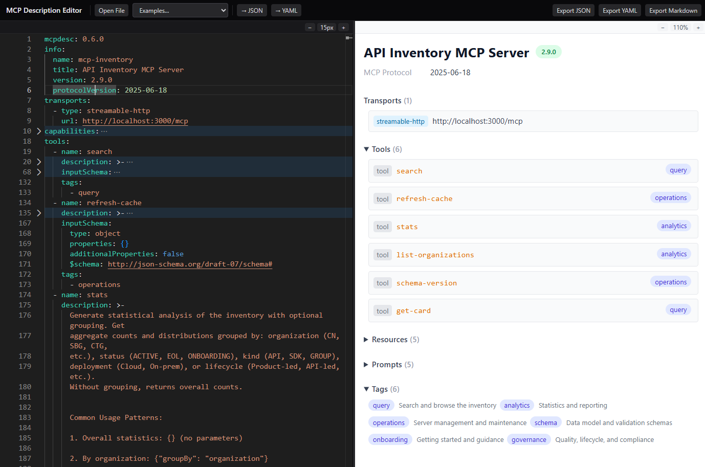

# MCP Toolkit: MCP Description Editor

A web-based editor for MCP Description documents — visualize, update, validate, and export documents.

[MCP Description](https://github.com/cisco-open/mcptoolkit-contract) is a portable, machine-readable contract format for MCP servers. Think "OpenAPI for MCP." 

This editor gives you a fast feedback loop while authoring or reviewing those contracts.



## The MCP Description (`mcpdesc`) format

An **MCP Description** (`mcpdesc`) is a portable, machine-readable contract that
declares everything an MCP server offers — tools, resources, prompts, transports,
and security — much like OpenAPI does for REST APIs.

This editor lets you author, validate, and preview mcpdesc documents. To generate
one from a live MCP server, use [`mcpcontract dump`](https://github.com/cisco-open/mcptoolkit-contract):

```bash
mcpcontract dump \
  --transport streamable-http \
  --url "https://your-mcp-server/mcp" \
  --output server.mcpdesc.json
```

> **Canonical source:** the MCP Description specification, versioned schemas, and
> full governance live in the
> [mcptoolkit-contract](https://github.com/cisco-open/mcptoolkit-contract)
> repository (`spec/` and `schemas/mcp-description/`). This editor vendors schema
> **v0.7.0** from that source.

## Features

- **Monaco Editor** — Full code editor with JSON Schema-driven autocomplete, inline validation squiggles, folding, and syntax highlighting for both JSON and YAML
- **Real-time validation** — AJV-based schema validation against MCP Description, plus semantic warnings (semver format, empty capabilities, duplicate names)
- **Structured preview** — Interactive "Cards" view with collapsible sections for server info, transports, security, capabilities, tools (with input/output schemas), resources, resource templates, prompts, and tags
- **Click-to-navigate** — Click any type bubble in the preview to jump to its definition in the editor
- **Markdown preview** — Handlebars-rendered markdown documentation, ready for copy-paste or export
- **JSON ↔ YAML** — Edit in either format; auto-detected on load, convertible with one click
- **Export** — Download as `.mcpdesc.json`, `.mcpdesc.yaml`, or `.md`
- **File import** — Open any `.json` or `.yaml` file from disk
- **Bundled examples** — Load examples of MCP Descriptions
- **LocalStorage persistence** — Edits survive page reloads
- **Pure client-side** — No backend required; host as static files or run locally

## Quick Start

```bash
npm install
npm run dev
```

Open http://localhost:5173 in your browser.

## Build

```bash
npm run build
```

Output goes to `dist/`. Serve it with any static file server:

```bash
npm run preview          # Vite preview server
# or
npx serve dist           # any static server
```

## Distribution

This repository is part of the **MCP Toolkit** suite and produces two separately distributed artifacts:

| Artifact | What it is | How it ships |
|----------|-----------|--------------|
| **MCP Description Editor** (this app, `mcptoolkit-editor`) | The full Monaco-based web editor. `package.json` is marked `"private": true`. | **Hosted** as a static site. Run `npm run build` and deploy the `dist/` folder to any static host (GitHub Pages, Netlify, Vercel, S3, …). It is not published to npm. |
| **`@cisco_open/mcptoolkit-viewer`** ([`packages/mcptoolkit-viewer/`](packages/mcptoolkit-viewer/)) | A drop-in, embeddable card-view web component for visualizing MCP Description documents — analogous to Swagger UI. | **Published to npm** as `@cisco_open/mcptoolkit-viewer`. Consumed by other MCP Toolkit projects via `<script>` tag or as a React component. |

### Publishing the viewer to npm

Publishing is tag-driven via [`.github/workflows/publish.yml`](.github/workflows/publish.yml):

1. Bump `version` in [`packages/mcptoolkit-viewer/package.json`](packages/mcptoolkit-viewer/package.json) and the `version` constant in `packages/mcptoolkit-viewer/src/index.tsx`.
2. Update both changelogs (see [`AGENTS.md`](AGENTS.md)).
3. Run `npm install` so [`package-lock.json`](package-lock.json) reflects the new versions, then run the prerelease gate and confirm it is green:

   ```bash
   npm run prerelease
   ```

   This runs `npm ci --dry-run` (verifies the lockfile is in sync — the publish workflow's `npm ci` fails otherwise) and builds both the editor and the viewer library.
4. Merge to `main`, then push a `v<version>` tag. The workflow builds the `mcptoolkit-viewer` workspace and runs `npm publish` with provenance. Pre-release versions (e.g. `-rc.N`) publish under the `next` dist-tag; stable versions under `latest`.

### Hosting the editor

The editor is pure client-side with no backend. Build it and serve the static output, then link back to this source repository from the deployed site. Deployment target is TBD.

See [`docs/maintainers/distribution.md`](docs/maintainers/distribution.md) for the full distribution model.

## Project Structure

```
src/
  core/                        # Reusable library (browser-compatible, no React)
    types.ts                   # MCP Description TypeScript types
    validator.ts               # AJV-based schema validator
    renderer.ts                # Handlebars markdown renderer
    template.ts                # Markdown Handlebars template
    mcpdesc-schema.json        # MCP Description JSON Schema
    index.ts                   # Public API barrel
  components/
    Editor.tsx                 # Monaco editor wrapper
    Toolbar.tsx                # Top toolbar (file, examples, format, export)
    SplitPane.tsx              # Resizable split-pane layout
    ValidationPanel.tsx        # Error/warning status bar
    preview/
      PreviewPanel.tsx         # Tab container (Cards | Markdown)
      CardView.tsx             # Structured interactive preview
      MarkdownView.tsx         # Handlebars-rendered markdown preview
  hooks/
    useDoc.tsx                 # Central state (React Context + useReducer)
  examples/
    index.ts                   # Bundled example documents
  App.tsx                      # Root layout
  main.tsx                     # Entry point
```

## Documentation Layout

- `docs/` — end-user guides and examples
- `docs/maintainers/` — maintainer-focused design and implementation references
- `docs/dust/` — archived planning and historical notes
- `docs/img/` — repository documentation images

### Core Library (`src/core/`)

The core module has **no React or DOM dependencies**. It exports:

- `McpDescValidator` — compile a JSON Schema once, then validate documents
- `McpDescRenderer` — render an MCP Description document to markdown via Handlebars
- Full TypeScript type definitions for MCP Description

This module is adapted from [mcptoolkit-contract](https://github.com/cisco-open/mcptoolkit-contract) and designed to be extractable as a standalone core package.

## Tech Stack

| Layer | Choice |
|-------|--------|
| Framework | React 18 + TypeScript |
| Build | Vite |
| Editor | Monaco Editor (`@monaco-editor/react`) |
| Validation | AJV 8 + ajv-formats |
| Markdown | Handlebars 4 |
| YAML | yaml 2 |
| Styling | Tailwind CSS 4 |

## License

This software is licensed under the Apache License 2.0. See [LICENSE](LICENSE) for details.


