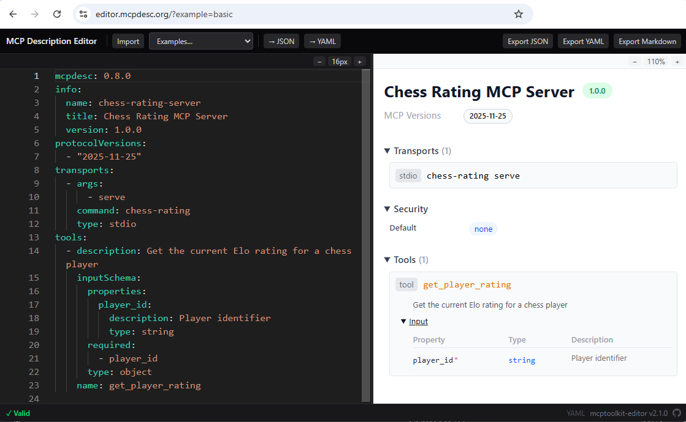

# MCP Toolkit: Editor

A web-based editor for [MCP Description](#the-mcp-description-mcpdesc-format) documents.

[](LICENSE)
[](CHANGELOG.md)
[](https://www.typescriptlang.org/)
[](https://mcpdesc.org)

## Version Support

> **Current: `main` / 2.x / MCP Description 0.8**
>
> Documents authored for MCP Description 0.7 are automatically migrated
> one-way to 0.8 when opened. For native 0.7 support, use the maintained
> [`v1/main` branch](https://github.com/cisco-open/mcptoolkit-editor/tree/v1/main)
> and the latest 1.x release.

- **Monaco Editor** — JSON Schema-driven autocomplete, inline squiggles, folding, and syntax highlighting for JSON and YAML
- **Real-time validation** — CSP-safe structural and semantic validation against MCP Description `0.8.0`
- **Cards preview** — collapsible server, transport, security, capability, and named example views, including protocol-scoped Effective Protocol Views
- **Click-to-navigate** — click any type bubble in the preview to jump to its source in the editor
- **Markdown preview** — Handlebars-rendered documentation, ready to copy-paste or export
- **JSON ↔ YAML** — edit in either format; convert with one click
- **LocalStorage persistence** — edits survive page reloads
- **Pure client-side** — no backend required




## Quick Start

### Run locally

```bash
git clone https://github.com/cisco-open/mcptoolkit-editor.git
cd mcptoolkit-editor
npm install
npm run dev
```

Open **http://localhost:5173**. The editor loads the bundled Minimal example;
your edits persist in local storage.

### Try the bundled examples

Click **Examples** in the toolbar to load a pre-built MCP Description, including
Minimal, Streamable HTTP, STDIO, multi-transport, multi-version, and
full-featured servers. Each example updates the preview instantly.

Link directly to a bundled example with its configured ID:

```text
http://localhost:5173/?example=full-featured
```

The URL example takes precedence over content saved in local storage.

### Load your own document

Use **Import** in the toolbar to load a `.json` or `.yaml` file from disk or a
public HTTPS URL. Remote servers must allow browser CORS requests. Imports are
limited to 1 MiB. You can also paste content directly into the editor; its
format is auto-detected.

To import a public document automatically, pass its encoded URL in the query
string:

```text
http://localhost:5173/?url=https%3A%2F%2Fexample.com%2Fserver.mcpdesc.yaml
```

### Validate and preview

- The **Validation panel** at the bottom shows schema errors and semantic warnings in real time.
- The **Cards tab** renders a structured, interactive preview — click any type badge to jump to its definition in the editor.
- The **Markdown tab** renders the document as human-readable documentation.

### Export

Click **Export** to download the document as `.mcpdesc.json`, `.mcpdesc.yaml`, or `.md`.


## The MCP Description (`mcpdesc`) format

An **MCP Description** (`mcpdesc`) is a portable, machine-readable contract that
declares everything an MCP server offers — tools, resources, prompts, transports,
and security — much like OpenAPI does for REST APIs.

This editor lets you author, validate, and preview mcpdesc documents. To generate
one from a live MCP server, use [`mcpcontract dump`](https://github.com/cisco-open/mcptoolkit-contract):

```bash
mcpcontract dump \
  --transport streamable-http \
  --url "https://your-mcp-server/mcp" \
  --output server.mcpdesc.json
```

> **Canonical source:** the MCP Description specification, versioned schemas, and
> full governance live in the
> [mcptoolkit-contract](https://github.com/cisco-open/mcptoolkit-contract)
> repository (`spec/` and `schemas/mcp-description/`). This editor targets
> **`0.8.0`** from that source. It accepts valid `0.7.0`
> documents on import, paste, or restore and migrates them one-way to the
> stable 0.8 document shape; earlier versions are unsupported.

## Build and deploy

```bash
npm run build   # outputs to dist/
npm run preview # local preview of the production build
```

The editor is pure client-side — deploy the `dist/` folder to any static host (GitHub Pages, Netlify, Vercel, S3, …). No backend required.

## Project Structure

```
src/
  core/                        # Reusable library (browser-compatible, no React)
    types.ts                   # MCP Description TypeScript types
    validator.ts               # CSP-safe 0.8 adapter; legacy 0.7 validation for migration
    validator.generated.js     # Legacy 0.7 validator used only to gate automatic migration
    renderer.ts                # Handlebars markdown renderer
    template.ts                # Markdown Handlebars template
    mcpdesc-schema.json        # MCP Description JSON Schema
    index.ts                   # Public API barrel
  components/
    Editor.tsx                 # Monaco editor wrapper
    Toolbar.tsx                # Top toolbar (file, examples, format, export)
    SplitPane.tsx              # Resizable split-pane layout
    ValidationPanel.tsx        # Error/warning status bar
    preview/
      PreviewPanel.tsx         # Tab container (Cards | Markdown)
      CardView.tsx             # Structured interactive preview
      MarkdownView.tsx         # Handlebars-rendered markdown preview
  hooks/
    useDoc.tsx                 # Central state (React Context + useReducer)
  examples/
    index.ts                   # Bundled example documents
  App.tsx                      # Root layout
  main.tsx                     # Entry point
```

### Core Library (`src/core/`)

The core module has **no React or DOM dependencies**. It exports:

- `McpDescValidator` — validate documents through the CSP-safe 0.8 standalone validator
- `McpDescRenderer` — render an MCP Description document to markdown via Handlebars
- Full TypeScript type definitions for MCP Description

This module is adapted from [mcptoolkit-contract](https://github.com/cisco-open/mcptoolkit-contract) and designed to be extractable as a standalone core package.

> **CSP note:** the editor validates 0.8 with
> `@mcpdesc/validator/standalone`, which does not use runtime code generation.
> The committed generated validator remains only for validating legacy 0.7
> documents before automatic migration.

### Tech Stack

| Layer | Choice |
|-------|--------|
| Framework | React 18 + TypeScript |
| Build | Vite |
| Editor | Monaco Editor (`@monaco-editor/react`) |
| Validation | `@mcpdesc/validator/standalone` |
| Markdown | Handlebars 4 |
| YAML | yaml 2 |
| Styling | Tailwind CSS 4 |

## Embeddable MCP Description Card View

[`@cisco_open/mcptoolkit-viewer`](packages/mcptoolkit-viewer/) is a lightweight,
embeddable card-view component — think Swagger UI for MCP — published separately
to npm. Use it to render MCP Description documents in any web page or React app.

**Via `<script>` tag** (no build step required):

```html
<link rel="stylesheet" href="https://unpkg.com/@cisco_open/mcptoolkit-viewer/dist/mcptoolkit-viewer.css">
<div id="mcpdesc"></div>
<script src="https://unpkg.com/@cisco_open/mcptoolkit-viewer/dist/mcptoolkit-viewer.js"></script>
<script>
  McpToolkitViewer({
    dom_id: '#mcpdesc',
    url: '/path/to/server.mcpdesc.json'
  });
</script>
```

**Via React component:**

```tsx
import { McpDescCardView } from '@cisco_open/mcptoolkit-viewer/react';
import '@cisco_open/mcptoolkit-viewer/dist/mcptoolkit-viewer.css';

function MyPage({ doc, validation }) {
  return (
    <div className="mcptoolkit-viewer-root">
      <McpDescCardView doc={doc} validation={validation} />
    </div>
  );
}
```

For the full API reference, options, and theming details see [`packages/mcptoolkit-viewer/README.md`](packages/mcptoolkit-viewer/README.md).

### Publishing the viewer to npm

Publishing is tag-driven via [`.github/workflows/publish.yml`](.github/workflows/publish.yml):

1. Bump `version` in [`packages/mcptoolkit-viewer/package.json`](packages/mcptoolkit-viewer/package.json) and the `version` constant in `packages/mcptoolkit-viewer/src/index.tsx`.
2. Update both changelogs (see [`AGENTS.md`](AGENTS.md)).
3. Run `npm install` so [`package-lock.json`](package-lock.json) reflects the new versions, then run the prerelease gate and confirm it is green:

   ```bash
   npm run prerelease
   ```

   This runs `npm ci --dry-run` (verifies the lockfile is in sync — the publish workflow's `npm ci` fails otherwise), `npm run verify:versions` (asserts the prebuilt `@cisco_open/mcptoolkit-editor-dist` version matches the root app version), and builds both the editor and the viewer library.
4. Merge to `main`, then push a `viewer-v<version>` tag. The workflow builds the `mcptoolkit-viewer` workspace and runs `npm publish` with provenance. Pre-release versions (e.g. `-rc.N`) publish under the `next` dist-tag; stable versions under `latest`.

> Release tags: the primary `@cisco_open/mcptoolkit-editor-dist` bundle uses the **default bare `v<version>`** tag; the viewer uses `viewer-v<version>`. See [`docs/maintainers/distribution.md`](docs/maintainers/distribution.md#tag--version-convention).

## License

This software is licensed under the Apache License 2.0. See [LICENSE](LICENSE) for details.


