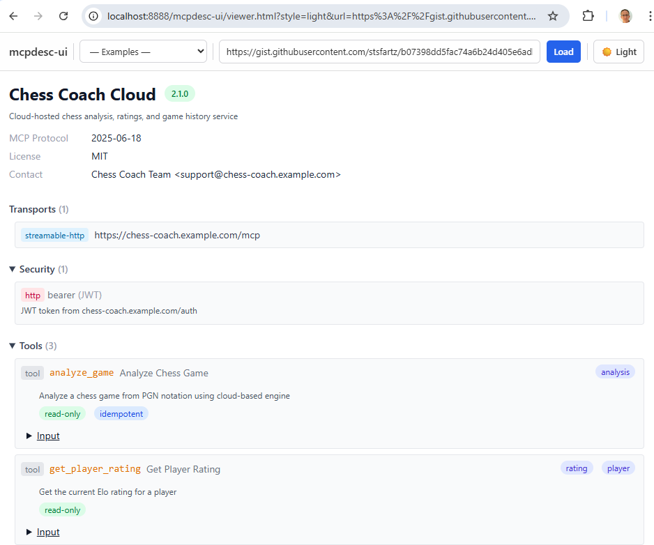

# mcpdesc-ui

Interactive card view for [MCP Description](https://github.com/anthropics/model-context-protocol) documents — analogous to what [Swagger UI](https://github.com/swagger-api/swagger-ui) is to the Swagger Editor.



## Quick Start — Script Tag

```html
<link rel="stylesheet" href="dist/mcpdesc-ui.css">
<div id="mcpdesc"></div>
<script src="dist/mcpdesc-ui.js"></script>
<script>
  McpDescUI({
    dom_id: '#mcpdesc',
    url: '/api/mcpdesc.yaml'
  });
</script>
```

## Quick Start — React Component

```tsx
import { McpDescCardView } from 'mcpdesc-ui/react';
import 'mcpdesc-ui/dist/mcpdesc-ui.css';

function MyPage({ doc, validation }) {
  return (
    <div className="mcpdesc-ui-root">
      <McpDescCardView doc={doc} validation={validation} />
    </div>
  );
}
```

## API

### `McpDescUI(options)`

| Option | Type | Default | Description |
|--------|------|---------|-------------|
| `dom_id` | `string` | — | **Required.** CSS selector for the container element. |
| `spec` | `McpDescDocument` | — | Pre-parsed MCP Description document object. |
| `url` | `string` | — | URL to fetch a YAML or JSON mcpdesc file from. |
| `theme` | `'light' \| 'dark'` | `'light'` | Color theme. |
| `defaultOpen` | `boolean` | `true` | Whether `<details>` sections start expanded. |
| `showValidation` | `boolean` | `true` | Show validation panel at the bottom. |

Returns a `McpDescUIInstance` with:
- `updateSpec(spec)` — Update the displayed document
- `reload()` — Re-fetch from the configured URL
- `destroy()` — Unmount and clean up

## Build

```bash
npm run build
```

## License

See root repository LICENSE.
